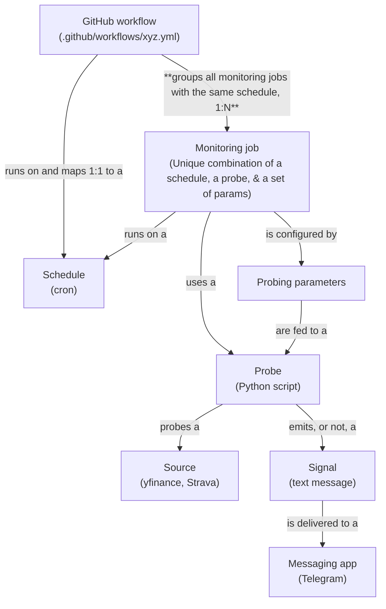

# :mailbox: Signals

Signals is a basic signaling tool which regularly probes some sources of information and sends signals accordingly.


# Ontology & architecture



# Development setup

Clone the repo and open it in VS Code:
```
git clone git@github.com:Konilo/signals.git
cd signals
code .
```

Select **Reopen in Container**. Dependencies and extensions are installed automatically ([Docker](https://www.docker.com/) required).

List the probes like so:
```
python signals/main.py --help

 Usage: main.py [OPTIONS] COMMAND [ARGS]...

╭─ Options ───────────────────────────────────────────────────────────────────────────╮
│ --install-completion          Install completion for the current shell.             │
│ --show-completion             Show completion for the current shell, to copy it or  │
│                               customize the installation.                           │
│ --help                        Show this message and exit.                           │
╰─────────────────────────────────────────────────────────────────────────────────────╯
╭─ Commands ──────────────────────────────────────────────────────────────────────────╮
│ daily_close      Monitor a list of tickers for previous close, close, and daily     │
│                  return                                                             │
│ sma_crossover    Monitor a ticker for crossovers of its close price and close price │
│                  SMA                                                                │
│ strava_to_gcal   Probe Strava for new activities and create a Google Calendar event │
│                  for each one                                                       │
╰─────────────────────────────────────────────────────────────────────────────────────╯
```

Get details about a specific probe like so:
```
python signals/main.py sma_crossover --help

 Usage: main.py sma_crossover [OPTIONS] TICKER LOOKBACK TRADING_HOURS_OPEN
                              TRADING_HOURS_CLOSE TIMEZONE

 Monitor a ticker for crossovers of its close price and close price SMA


╭─ Arguments ─────────────────────────────────────────────────────────────────────────╮
│ *    ticker                   TEXT     Yahoo Finance ticker to probe                │
│                                        [default: None]                              │
│                                        [required]                                   │
│ *    lookback                 INTEGER  Lookback window (in days) over which the SMA │
│                                        is computed                                  │
│                                        [default: None]                              │
│                                        [required]                                   │
│ *    trading_hours_open       TEXT     Opening hour of the ticker's exchange        │
│                                        (HH:MM, ISO 8601, local time)                │
│                                        [default: None]                              │
│                                        [required]                                   │
│ *    trading_hours_close      TEXT     Closing hour of the ticker's exchange        │
│                                        (HH:MM, ISO 8601, local time)                │
│                                        [default: None]                              │
│                                        [required]                                   │
│ *    timezone                 TEXT     Timezone of the ticker's exchange (e.g.,     │
│                                        America/New_York)                            │
│                                        [default: None]                              │
│                                        [required]                                   │
╰─────────────────────────────────────────────────────────────────────────────────────╯
╭─ Options ───────────────────────────────────────────────────────────────────────────╮
│ --upward-tolerance          FLOAT  Starting from a 'neutral', or 'below' state, the │
│                                    price must exceed 100 + <upward_tolerance>% of   │
│                                    the SMA to trigger a signal                      │
│                                    [default: 0]                                     │
│ --downward-tolerance        FLOAT  Starting from a 'neutral', or 'above' state, the │
│                                    price must fall below 100 -                      │
│                                    <downward_tolerance>% of the SMA to trigger a    │
│                                    signal                                           │
│                                    [default: 0]                                     │
│ --previous-state            TEXT   Last state: 'neutral', 'below', or 'above'       │
│                                    [default: neutral]                               │
│ --help                             Show this message and exit.                      │
╰─────────────────────────────────────────────────────────────────────────────────────╯
```

Find the Run and debug configurations under `.vscode/launch.json`.

Manage Python dependencies with [uv](https://docs.astral.sh/uv/getting-started/features/#projects) commands.

A GitHub workflow runs tests on PRs.
